[[abstract]]

== Abstract model

=== Introduction

This clause describes, in an abstract way, the resources and operations
required to support the  operation of a Geo-Synchronization service.  The
discussion in this section is intended to be agnostic of any particular
implementation.  The remaining clauses of this document describe a
concrete implementation of this standard for various bindings.

=== Resources

==== Events

This document defines three event types that are handled by a
Geo-Synchronization Service (GSS).  These are:
Change  Proposal events, Resolution events and Replication events.

A change proposal event indicates that a collaborating party has signaled a
desire to add new data to or modify/delete existing data from a data provider's
data store.

A resolution event signals to a collaborating party or data publisher that
their proposed change has been reviewed and has either been accepted or
rejected.

A replication event signals that, as a result of a proposed change, a change
has been made to a data provider's data store and describes what that change
is.  Interested parties can then retrieve the description of the change and
apply that change to their local copy of the data thus synchronizing their
data store with the data provider's data store.

The <<EventProperties, Event Properties>> table lists the minimum set of
properties that may be used to describe an event.

[#EventProperties,reftext='{Event properties} {counter:table-num}']
.Event properties
[cols="20%,20%,60%",width="90%",options="header"]
|===
|Property Name |Cardinality |Description
|id |1 |A unique identifier for the event.
|author |0 or N |A description of the entity or entities signaling the event.
|updated |1 |A timestamp indicating when the event was created or last changed.
|title |1 |A human-readable title for the event.
|summary |0 or 1 |A human-readable narrative describing the nature of the event.
|content |0 or 1 |Any payload that needs to be associated with the  event.  For example, a WFS Transaction describing a  proposed change.
|category |0 or N |A tag that classifies the event according to some classification scheme.  An event may be classified  many times using different classification schemes.
|link |0 or N |A link to related resources or events.
|where |0 or 1 |A geometry that geo-locates the event.
|===

The specific type for each of these properties is implementation dependent.

[[EventChannels]]
==== Event channels

An event channel is a conduit for the dissemination of events.

include::requirements/REQ001.adoc[]

The Proposed Change channel allows data publishers to accept updates to their
data from collaborative participants or data publishers.  Participants register
proposed changes to the Proposed Change event channel.  A proposed change can
propose the creation of new data or the modification/deletion of existing data.

Proposed changes are reviewed in order to ensure that each change satisfies
quality or correctness criteria established by the data provider.  The review
process can be performed manually or automatically the end result being that
each proposed change is either accepted or rejected.  The result of the review
process to accept or reject a change is registered in the Resolution event
channel.  

include::requirements/REQ002.adoc[]

include::requirements/REQ003.adoc[]

Replication events always describe a change made to a single feature.
Interested parties, who wish to maintain a synchronized copy of all or part of
a data provider's data store can read the events from the Replication channel
and apply them to their local copy.

The <<EventChannel, Even Channel>> table lists the minimum set of properties
that may be used to characterize and event channel.  Specific implementations
of this specification may include additional properties.

[#EventChannelProperties,reftext='{Event channel properties} {counter:table-num}']
.Event channel properties
[cols="20%,20%,60%",width="90%",options="header"]
|===
|Property Name |Cardinality |Description
|id |1 | A unique identifier for the event channel.
|title |1 |A human-readable title for the event channel.
|updated |1 |A timestamp indicating where the event channel was created or the last time it was updated.
|event |0 or N |Zero or more event entries. 
|===

==== Publications

A publication is an ad-hoc event channel or view of an event channel that has
been filtered in order to identify events that satisfy some user-specified
predicates.  For example, a publication might be created that identifies events
that occur within a specific geographic region by applying a spatial predicate
(e.g. Within) to an event channel.  

Publications are read-only objects since they are derived by querying the
primary event channels that a GSS manages (see <<publications,Publications>>).

Figure 1 defines the structure of a Publication.
 
[[PublicationUML]]
.Publication UML class diagram
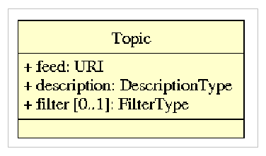

==== Subscriptions

A subscription is used to signal a desire to be notified whenever an event
appears in an event channel or publication.  Subscriptions are considered
resources because they can be created, destroyed and operated upon.

Figure 2 defines the structure of a Subscription.

[[SubscriptionUML]]
.Subscription UML class diagram

=== Identity management

==== Users

The GSS is a secure service and this document assumes that users have to be
authenticated in order to use the server.  Thus, this candidate standard
assumes that some identity management system is implemented by or available
to the GSS.  This candidate standard makes no assumption about which identity
management system the server implements or uses.  

include::requirements/REQ004.adoc[]

include::requirements/REQ005.adoc[]

==== Roles

This candidate standard assumes that the following user-roles are available:

1. User: can read any event channel 
2. Data publisher: can create entries in the Proposed Changes event channel
3. Reviewer: can create entries in the Resolution event channel

[[PermissionModel,Permission model]]
==== Permission model

include::requirements/REQ006.adoc[]

include::requirements/REQ007.adoc[]

include::requirements/REQ008.adoc[]

include::requirements/REQ009.adoc[]

include::requirements/REQ010.adoc[]

include::requirements/REQ011.adoc[]

include::requirements/REQ012.adoc[]

include::requirements/REQ013.adoc[]

Any user can subscribe to any event channel or publication.  Only a subscription
owner can pause, resume, renew or cancel that subscription.

include::requirements/REQ014.adoc[]

=== Service interface

==== Common types

Figure 3 defines types that are referenced in the remainder of this sub-clause.

[[CommonTypesUML]]
.Common types UML class diagram
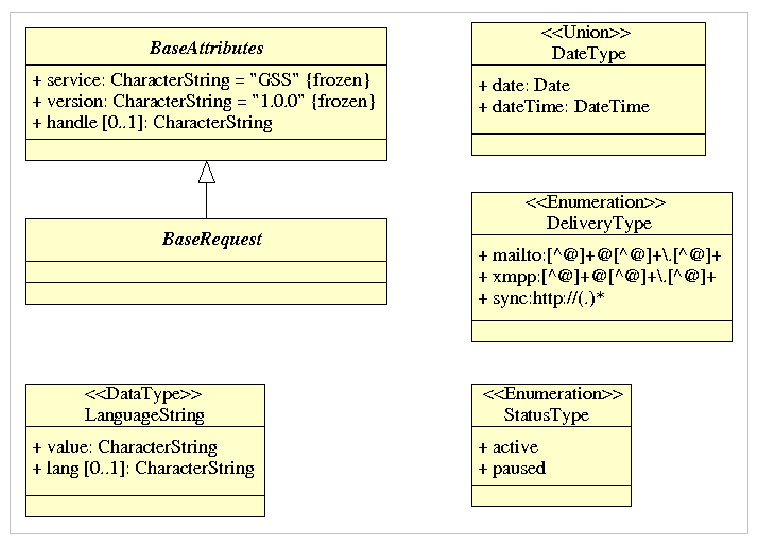

==== Discovery

include::requirements/REQ015.adoc[]

The specific format of the metadata is implementation dependent.  Such metadata
may include a description of who is providing the service, the operations that
the service implements, some light-weight metadata about the content of the
service and perhaps some indication of the kinds of queries that can be
performed by the service.

Figure 4 defines the operations of the Discovery service interface and their
parameters.

[[DiscoveryUML]]
.Discovery UML class diagram
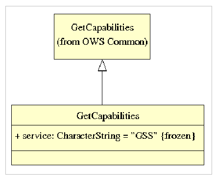

==== Transaction

A primary function of a Geo-Synchronization service is to manage the contents of
event channels (see <<EventChannels,Event Channels>>).  

include::requirements/REQ016.adoc[]

Figure 5 defines the operations of the Transaction service interface and their
parameters.

[[TransactionReqUML]]
.Transaction operations UML class diagram
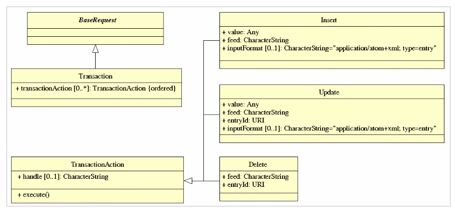

The response to a Transaction operation is defined in Figure 6.
 
[[TransactionResUML]]
.Transaction response UML class diagram
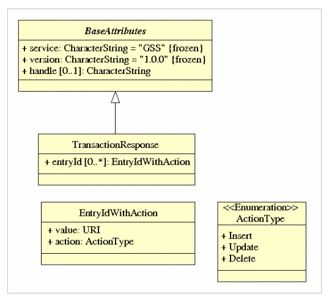

==== Query

include::requirements/REQ017.adoc[]

Spatial predicates include both geometric and temporal constrains.  Temporal
constraints are particularly important since they allow clients to poll an
event channel for new events by querying the channel for events that have
occurred since the last time the channel was queried.

include::requirements/REQ018.adoc[]

Figure 7 defines the operations of the Query service interface and their
parameters.
 
[[QueryUML]]
.Query UML class diagram
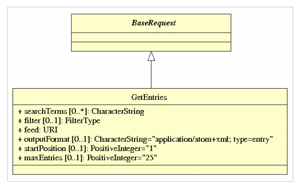

==== Changes

===== Introduction

A primary function of a GSS is to allow authorized or automated reviewers to
vet changes before they are applied to a data provider's data store.  The
change management interface defines operations for accepting or rejecting
change proposals one at a time or in bulk.

Figure 8 defines the operations of the Change management service interface
and their parameters.
 
[[ChangeReqUML]]
.Change management operations UML class diagram
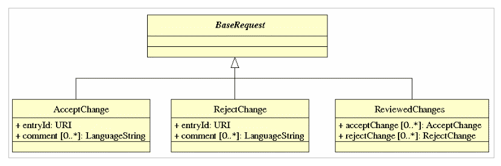

The response to Change management operations is defined in Figure 9.

[[ChangeResUML]]
.Change management response UML class diagram
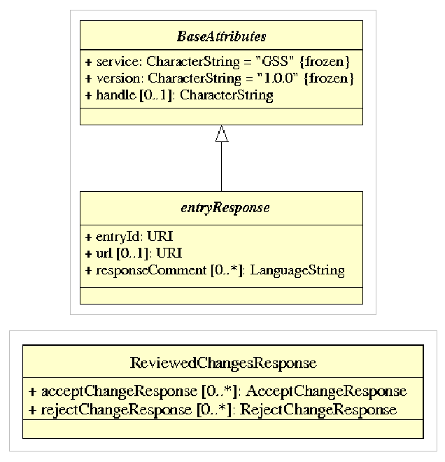

===== Accept change proposal

The AcceptChange operation marks a change proposal event as accepted.  

include::requirements/REQ019.adoc[]

include::requirements/REQ020.adoc[]

include::requirements/REQ021.adoc[]

===== Reject change proposal

The RejectChange operation is used to indicate that a change proposal event has
been rejected.  This means that a reviewer (human or otherwise) has determined
that the proposal is not acceptable.  

include::requirements/REQ022.adoc[]

include::requirements/REQ023.adoc[]

===== Bulk accept/reject processing

The ReviewedChanges operation contains one or more AcceptChange and/or
RejectChange operations and enables bulk processing of change proposals.

[[AbstractPublications]]
==== Publications

Identifying events to trigger notification is done through the use of
Publications (see <<publication,Publications>>).  The
<<PublicationManagementAPI, Publication management API>> table list the
set of operations that may be used to create, discover and remove
publications.

[#PublicationManagementAPI,reftext='{Publication management API} {counter:table-num}']
.Publication management API
[cols="30%,70%",width="90%",options="header"]
|===
|Operation Name |Description
|CreatePublication |Create an ad-hoc event channel based on one of the three Geo-Synchronization feeds.  A publication can include non-spatial, spatial and temporal predicates to identify entries that satisfy certain criteria.  For example, a publication can be created that filters the Proposed Change channel for entries that lie within a specific geographic area.
|RemovePublication |Delete a publication from the service.
|ListPublications |Get a list of all available publications.
|===

The <<PublicationUML,Publication management UML class diagram>> defines the
operations and parameters for the Publication service interface which, in
combination with the Subscription service interface (see
<<subscription,Subscriptions>>), allows users to be notified of events of
interest.
 
[[PublicationUML]]
.Publication management UML class diagram
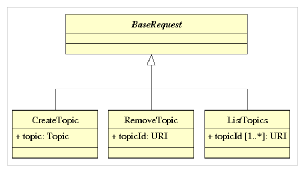

This candidate standard assumes that some mechanism for sending notification
messages to subscribers is implemented by or available to the GSS.  This
candidate standard makes no assumption about which notification system the
server implements or uses.

The response to the ListPublications operation of the Publications service
interface is defined in <<ListPubResUML,ListPublicationsResponse UML class
diagram>>.

[[ListPubResUML]]
.ListPublicationsResponse UML class diagram
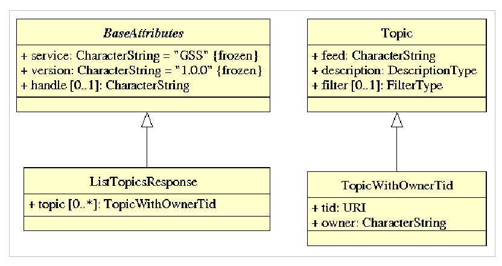

The response to the other operations in the Publications service interface is
defined in the <<PubResUML,Publication management responses UML class diagram>>.

[[PubResUML]]
.Publication management responses UML class diagram
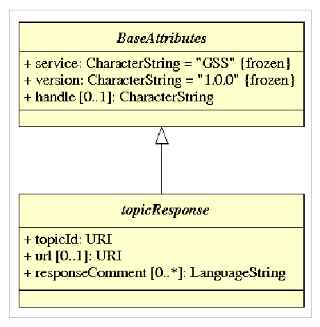

==== Subscriptions

A Geo-Synchronization service manages three primary event channels (see
<<EventChannels,Event Channels>>) and any number of ad-hoc event channels
or publications (<<publications,see here>>).  The subscription interface
allows users to register their interest in being notified whenever an event
is registered in an event channels that a GSS manages.

The <<SubscriptionAPI,Subscription API>> table lists the operations of the
subscription API and their descriptions.

[#SubscriptionAPI,reftext='{Subscription API} {counter:table-num}']
.Subscription API
[cols="30%,70%",width="90%",options="header"]
|===
|Operation Name |Description
|Subscribe | Subscribe to a publication for the purpose of notifications.  Whenever a new entry is created in a base feed that satisfies the publication predicates, a notification action is performed by the Geo-Synchronization service to all 
subscribers.  
|ListSubscriptions |Get a list of subscriptions to which the current user has 
subscribed.
|PauseSubscription |Pause notifications for the specified subscription.
|ResumeSubscription |Restart notifications for the specified subscription.
|CancelSubscription | Permanently stop receiving notifications for the specified subscription.
|===

The <<SubscribeUML,Subscription interface UML class diagram>> defines the
operations of the Subscription service interface and their parameters.
 
[[SubscribeUML]]
.Subscription interface UML class diagram
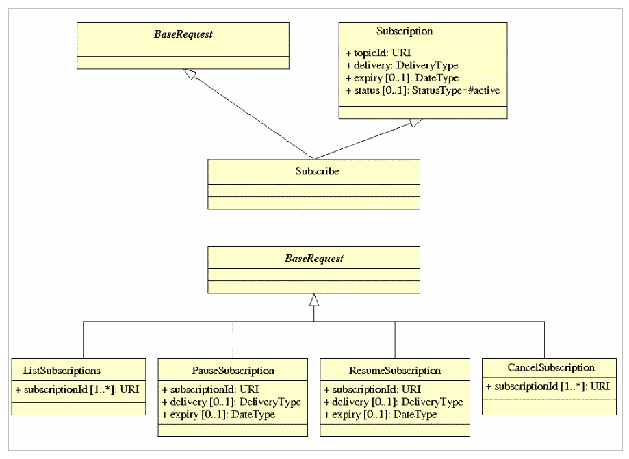

The response to the ListSubscriptions operation of the Subscription service
interface is defined in the
<<ListSubResUML,ListSubscriptionsResponse UML class diagram>>.
 
[[ListSubResUML]]
.ListSubscriptionsResponse UML class diagram
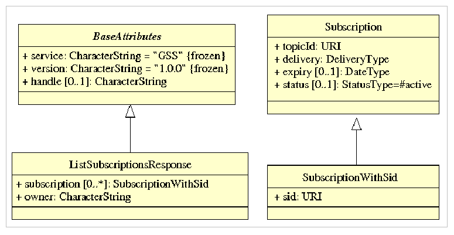

The response to the other operations in the Subscription service interface is
defined in the <<SubResUML,Subscription interface responses UML class diagram>>.

[[SubResUML]]
.Subscription interface responses UML class diagram
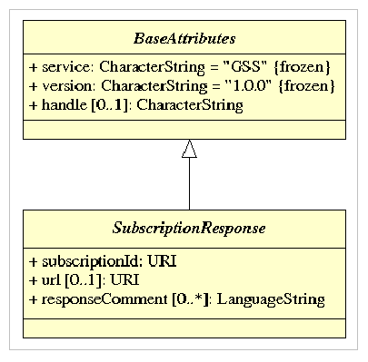

==== Synchronization

===== Description
Synchronization is the process whereby one or more target feature types
maintain an up-to-date copy of data stored in a source feature type.  

include::requirements/REQ024.adoc[]

The desire to initiate synchronization is signaled using the Subscribe
operation (see <<Subscribe,Subscribe>>).  Synchronization is supported
by the information maintained in the Replication event channel and can
be characterized by what is synchronized and how it is synchronized.

Several modes of synchronization can be envisioned based on what is
synchronized:

1. A target server can synchronize with a source server exactly mirroring the data and schema found in the source server.
2. A target server can synchronize with a source server exactly mirroring the schema but only synchronizing a portion of the source data.  Which portion is synchronized may be specified by filtering the Replication event channel.
3. A target server can synchronize with a source server exactly mirroring the data from the source server but applying the changes from the source to a different schema in the target server.
4. A target server can synchronize with a source server synchronizing only a portion of the source server and applying the changes from the source server to a different schema in the target server.

There are also two ways that synchronization can be executed:

1. Events can be read from the Replication channel by some agent outside the GSS and then applied to the target server.  This external agent would use the GSS to filter the Replication channel to obtain events of interest, it would manipulate them as required (e.g. transforming the schemas from the source data store to the target data store) and then applying them to the target server.
2. The GSS can act as the synchronization agent and automatically apply changes to one or more target servers that have subscribed to the Replication event channel or a publication created on the Replication channel.

===== Feature identification

An important aspect of synchronization is determining the equivalence of a
feature in a source  data store with a feature in a target data store.  There
is a high probability the feature identifiers maintained in the source data
store will not be the same as those found in the target data store and so
some manner of determining equivalence is required.

Thus far two strategies have been tested:

1. Global feature identifiers: This approach has some external authority assigning a global identifier to each feature that both the source and target data stores are responsible for maintaining.  This allows feature equivalence to be determined by simply comparing the global identifiers of the two features.  If the identifiers are equal then the corresponding records in the source and target data store represent the same feature.  This was the approach used in the CGDI
Pilot.
2. Property comparison: This approach identifies corresponding features in the source and target data stores by comparing all the feature properties and most importantly the geometry.  If all the properties are equal and the geometry of the features is the same then they are considered to be equivalent features.  This approach has been tested by the Carbon Project.

With the existence of the AcceptChange operation, another possibility presents
itself:

1. Mapping tables -- A requirement of the AcceptChange operation is that the GSS behave like a client and apply each change event in the Replication event channel to each subscribed target data store.  As such, the GSS has access to the feature identifiers of all newly created features and can thus maintain a mapping between the feature identifiers on a source data store and the feature identifiers on a synchronizing target data store. 

===== Initial seeding

In general, before synchronization commences between a source and target server,
the target server needs to be seeded or initialized with data from the source
server so that both server start from the same state.  Subsequent modifications
to the source server are then synchronized to the target server.  How a target
server is initialized from a source server is not covered in this standard.
However,  several possibilities have been investigated in test bed activities
in the  Open Geospatial Consortium.  First a geo-package (see OGC 12-128r14,
GeoPackage Encoding Standard, version 1.2, August 2017) may be used to bulk
transport the data (either physically or electronically) from the source to
the target that may then be initialized by loading the data from the
geo-package.  Similarly, a Geodata Bulk Transfer (GBT) package (see OGC
11-085r1, OGC® OWS-8 Bulk Geodata Transfer Using GML Engineering Report,
November 2011) may be used for the same purpose.

