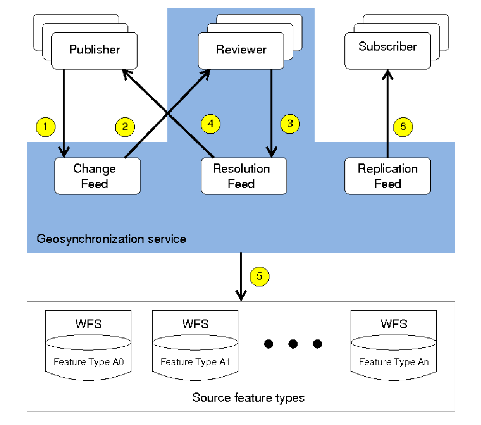

[[workflow]]

== Workflow

The following wiring diagram that illustrates the basic use case for a
Geo-Synchronization service.

[[GSSWiring]]
.Geo-Synchronization service wiring diagram

This standard assumes that a data provider's data store(s) is(are) accessible
through a Web Feature Service (WFS) interface and thus all feature types in
the diagram are assumed to accessible via web feature services.

Within the figure the following actors are represented:

1. At the top left are collaborating participants or data publishers (aka "The Crowd".
2. At the bottom, a set of feature types accessible via web feature servers (i.e. A0, A1, ..., An) that are within the control domain of the GSS (i.e. transactional access to these feature types is mediated by the GSS).
3. At the top right, subscribers who are synchronizing feature types that are outside the control domain of the GSS.  Subscribers either access the replication feed themselves or have the GSS process the replication feed to synchronize data between features types within the control domain of the GSS (i.e. A0, A1, ... ,An) and feature types outside the control domain of the GSS.

With reference to the numbers within the yellow circles, the basic GSS use case
proceeds as follows:

1. A data publisher posts a proposed change to the GSS for one of the feature types within the GSS's domain of control (i.e. A0, A1, ... ,An ).
2. The proposed change is read from the Change Feed and reviewed to ensure that it satisfies correctness and quality standards established by the data provider whose feature type is to be updated (i.e. one of A0, A1, ... An in this diagram).  The review process can be manual or automatic.
3. If the proposed change is rejected, that event is registered in the Resolution Feed and a notification is sent to all interested subscribers.
4. If the propose change is accepted, that event is registered in the Resolution Feed...
5. ...and the GSS applies the proposed change to the intended feature type.
6. ...and the GSS registers all the changes made to the target feature type (i.e. A0, A1, ... ,An) in the Replication Feed.  It also sends a notification to all interested subscribers that the proposed change has been accepted and that changes have been made to one of the feature types within the Geo-Synchronization server's control domain (i.e. A0, A1, ... An).
7. Changes posted to the Replication feed may also be applied, by the GSS, to any external feature type that has subscribed for synchronization.  The changes are first passed through the schema translation engine to, if necessary, convert them to the schema of each target feature type.
8. If a schema translation is required, transformation metadata is read by the GSS and the transaction is transformed to the schema of the target feature type ...
9. ...and then the change is applied to the target feature type via WFS.
